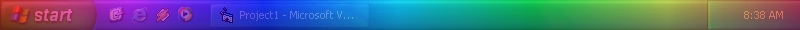



## Magnet Visual Effect for WinXp Taskbar

### Description

This neat little thing Changes the Colors of the taskbar on Windows XP only. it makes it lake a mgnet is ner a Ray-Gun screen.
 
### More Info
 

             |
---                |---
**Submitted On**   |2002-08-20 09:47:48
**By**             |[Leo Barsukov](https://github.com/Planet-Source-Code/PSCIndex/blob/master/ByAuthor/leo-barsukov.md)
**Level**          |Intermediate
**User Rating**    |3.8 (19 globes from 5 users)
**Compatibility**  |VB 6\.0
**Category**       |[Graphics](https://github.com/Planet-Source-Code/PSCIndex/blob/master/ByCategory/graphics__1-46.md)
**World**          |[Visual Basic](https://github.com/Planet-Source-Code/PSCIndex/blob/master/ByWorld/visual-basic.md)
**Archive File**   |[Magnet\_Vis1217088232002\.zip](https://github.com/Planet-Source-Code/leo-barsukov-magnet-visual-effect-for-winxp-taskbar__1-38220/archive/master.zip)

